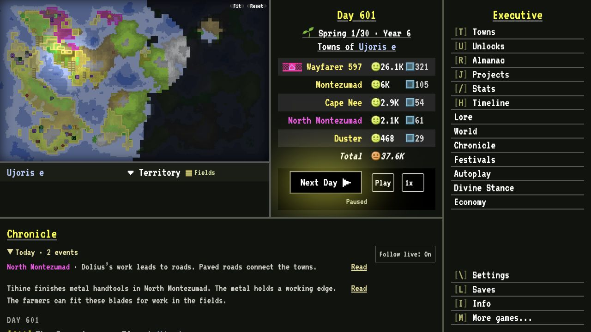
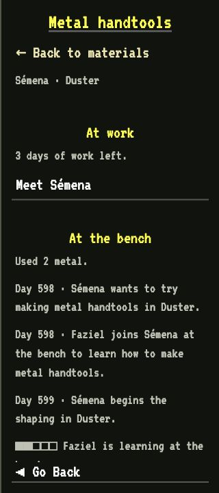
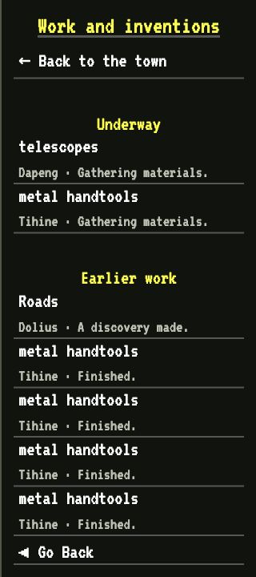
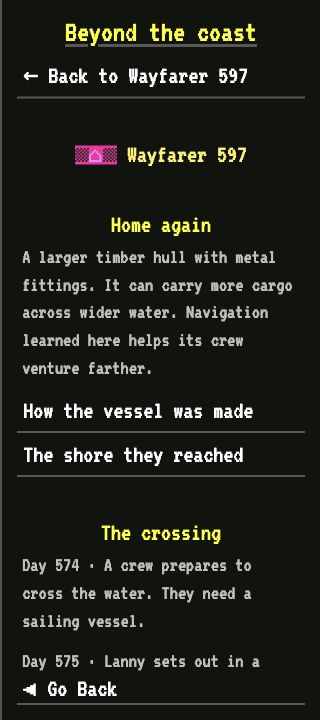
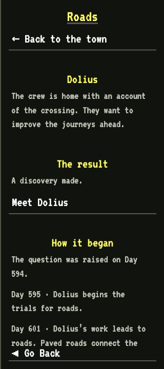
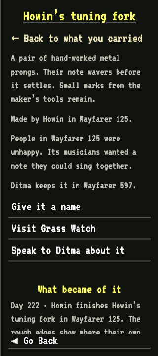
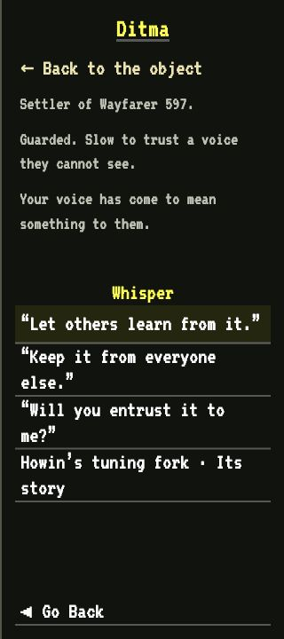
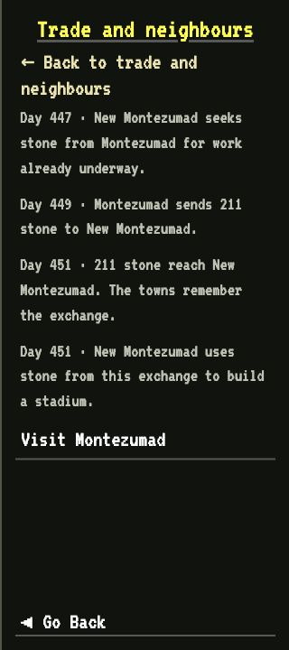
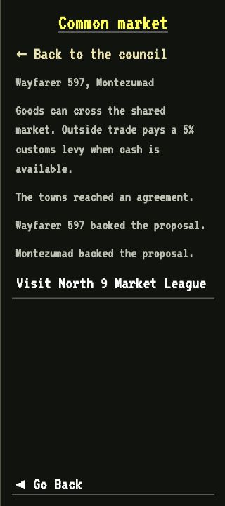

# paultendo’s GenTown overhaul

Follow a tool from the workshop to the fields, a crew from shore to shore, or a rumour into a discovery. Towns keep their own needs, knowledge and grudges. You can help them, leave an object behind, or give someone a dangerous idea.

Built on **[GenTown by R74n](https://r74n.com/gentown/)**. Version **1.6.93**. Based on **GenTown 1.4 / gt5**, checked on 4 October 2026.

[](docs/screenshots/world.jpg)

*Ujoris e, Day 601. Five towns share the known land. Beyond their borders, much of the world is still hidden.*

## Install

Export your existing save from **Saves** first. In GenTown, choose **Settings → Add mod** and paste:

```text
https://cdn.jsdelivr.net/gh/paultendo/gentown-mods@v1.6.93/paultendo-mod.js
```

Reload after adding it. This replaces older paultendo mod URLs automatically. The Chronicle shows `paultendo-mod active (v1.6.93)` after settling a town and advancing a day. Use the versioned CDN URL. Raw GitHub script URLs and the mixed-case GitHub Pages path do not install reliably through GenTown’s loader. Avoid combining this with other large overhaul mods.

This addresses the installation issue reported in [GenTown-Mods #19](https://github.com/R74nCom/GenTown-Mods/issues/19).

## A few stories from one world

These are real game screens from a release-test campaign. The people, work, journeys and agreements are recorded in its save. Click any image to see it at full size.

### At the bench

Sémena is shaping metal handtools in Duster, with Faziel learning alongside her. In North Montezumad, telescope work is waiting for supplies. Each job has its own workers, ingredients and progress.

<a href="docs/screenshots/workshop.jpg"></a> <a href="docs/screenshots/work.jpg"></a>

### Across the water

Lanny’s crew brought a sailing vessel home after reaching another shore. An account of the crossing gave Dolius a reason to investigate roads. The resulting discovery took trials, time and stone.

<a href="docs/screenshots/voyage.jpg"></a> <a href="docs/screenshots/discovery.jpg"></a>

### What became of Howin’s fork

Howin made a tuning fork when the town’s musicians wanted a note they could sing together. It passed through several hands, survived the loss of its town, and was found by Ditma. You can name creations and whisper to the people who keep them. Ditma could share the fork, hide it, or entrust it to the Traveler.

<a href="docs/screenshots/object.jpg"></a> <a href="docs/screenshots/whisper.jpg"></a>

### Neighbours with terms

New Montezumad needed stone for a stadium. The exchange records the request, shipment, arrival and eventual use. Elsewhere, two towns agreed to a common market with an outside customs levy. Council talks keep the obligations and the towns’ votes.

<a href="docs/screenshots/trade.jpg"></a> <a href="docs/screenshots/council.jpg"></a>

The same world also has creeds, rivalries, celebrations, wars and places marked by earlier inhabitants. Weather and disasters can leave lasting changes to the land. Much later, local advances and constructed vessels can open journeys to other worlds. The comparison below explains those systems and how far they go.

[Capture details](docs/screenshots/captures.txt).

## Compared with base GenTown

<details>
<summary>Open the full feature comparison</summary>


This comparison is against the [current official game](https://r74n.com/gentown/), **GenTown 1.4 / gt5**, checked on **4 October 2026**. Its scripts match the [vendored source snapshot](vendor/gentown/upstream.json). GenTown already has procedural worlds, town building, discoveries, occupations, taxes, governments, colonies, diplomacy, war and disasters. This mod keeps that foundation and extends how those systems interact.

| Area | Base GenTown 1.4 | What this mod adds or changes |
| --- | --- | --- |
| Discoveries | A shared unlock tree covers farming, travel, fire, smithing, trade, government, education, military technology and astronomy. | 43 further advances, with town-specific inquiries, workers, prototype supplies, prerequisites and working time. Harvests, exchanges, illness, workshop practice and observations can give people reasons to investigate. New advanced results belong to the town that completes the work. |
| Materials and making | Towns gather and use crops, livestock, rock, lumber, metal and cash. Construction and occupations already consume resources. | Clay, sand, coal, charcoal, bricks, pottery, glass, steel, paper, shaped tools and vessels extend the economy. Material properties help select suitable supplies for writing, building, fuel and tools. Workshops spend actual ingredients, share available hands, seek missing supplies and retain makers, methods and apprenticeships. |
| Food, housing and migration | Inhabitants eat, work, grow in number, die and move between settlements. | Growth responds to recent meals, usable land, local building methods and maintained buildings. Sustained missed meals cause famine. Migration transfers actual people, jobs, accepted supplies and a share of private wealth. Crowding can limit voluntary arrivals. |
| People and the Traveler | Occupations and influences describe the inhabitants. The player guides them through proposals. | Named people representing actual working roles acquire outlooks, practice and histories. The Traveler can leave objects, whisper ideas and influence encounters. Recipients can resist or put an object to a different use. Interventions can encourage care, study, secrecy, coercion or conflict. |
| Objects and memory | Town, species and place names accompany the event history. | Player-named creations retain their maker, materials, predecessors and later uses. Rare circumstances can give an ordinary object meaning during a war. Objects entrusted to the Traveler can survive later passages through the same world's time loop. The first passage starts with a compass, clear lens and tuning fork. |
| Exploration and transport | Town expansion, paths, boats and travel discoveries support settlement and contact. | Expeditions and material surveys retain destinations, obstacles, samples and sources. Distant-shore rumours can lead to crossings where the generated geography permits them. Boats require construction and available crews. Journeys and exchanges track cargo, provisions, access and returns. Roads follow traffic and maintenance. |
| Trade and money | Trade, currencies, taxes, private wealth, government funds and economic laws already exist. | Shortages and unfinished work create demand for particular goods. Exchanges move finite supplies and can carry practical guidance. Credit records claims on real wealth, while access, dues, embargoes, aid and theft affect relations. Keeping accounts requires local knowledge, materials and available workers. |
| Beliefs and culture | Faith, religious laws, happiness and education influence town affairs. | Town values, named creeds, teachings, customs and religious movements affect responses to needs and neighbours. Contact and pressure can spread beliefs or cause reform and schism. Disasters can acquire spiritual meaning. Festivals, personal work and shared creations give communities occasions to celebrate. |
| Government and self-determination | Laws, monarchy, democracy, republics, revolts, colonies and conquest already exist. | Ordinary reforms respond to sustained competing preferences. Council talks retain obligations, votes and outcomes. Towns can negotiate common markets, defence pacts, confederations, federations, united republics, shared crowns and feudal compacts. Dependence, autonomy and grievances can drive political separation or a change of protector. |
| Diplomacy and war | Towns negotiate, declare war, fight, capture territory and make peace. | Needs, values, shared history and grievances help motivate relations. Agreements and wars have recorded obligations and aims. Taken supplies leave real losses and grievances. Hunger and recovery matter to fighting. Existing handtools can help civilians resist an attack and wear through use. Native GenTown still resolves combat. |
| Weather and the land | Procedural terrain has elevation, temperature and moisture. Wildfires, hurricanes and earthquakes damage towns and their surroundings. | Seasons and weather affect conditions. Seeded plates and faults weight earthquake and volcanic risk. Drainage follows terrain heights, with retained water, floods, erosion and sediment deposition. Tree cover, scorched land and exposed materials can affect later work and settlement. |
| Records, clues and lore | The Chronicle and Timeline record events. Astronomy reveals other worlds and telescopes reveal moons. | News stories link to actual changes and can include saved quotes from named residents. Reporting uses available observations and records rather than revealing everyone's exact private wealth. Written accounts, carved signs on outcrops and recorded buildings, diagrams, objects and unfamiliar effects can carry clues. Curiosity can precede understanding. |
| Other worlds | Astronomy provides views of the generated star system. | Early observations stay with a town's night charts. Wider views appear later. Actual flights require local advances, constructed vessels and supplies. Rocketry enables preparation, while passenger travel also needs life support. Settlement needs people, tools, building supplies, provisions and suitable landing ground. Settlers carry their supported knowledge. Inactive worlds continue supported simulation work. |
| Playing and saving | Native prompts, panels, maps, unlocks and saves provide the interface. | Linked news with coloured flags, readable work histories, explanatory unlock entries, discovery-gated menus and clearer live decision controls. Autoplay offers pause and speed controls. Map redraws, late installation, reloads, background worlds and save size received compatibility fixes. |

</details>

<details>
<summary>The 43 additional advances</summary>

- **Farming:** Fertilization, Selective Breeding, Mechanized Farming, Agricultural Science.
- **Travel:** Roads, Sailing Ships, Navigation, Steam Power, Railways, Rocketry, Life support.
- **Fire:** Kilns, Forges, Gunpowder, Engines.
- **Smithing:** Steel, Architecture, Machinery, Precision Engineering.
- **Trade:** Banking, Contracts, Markets, Guilds, Corporations.
- **Government:** Taxation, Bureaucracy, Courts, Constitution.
- **Education:** Writing, Libraries, Printing, Universities, Scientific Method, Medicine.
- **Military:** Fortifications, Standing Armies, Firearms, Artillery.
- **Faith:** Rituals, Temples, Priesthood, Scripture, Monasteries.

These are added discovery milestones. Their names do not mean the corresponding activity was entirely absent from base GenTown. For example, the base game already has taxes and temples. Opening a discovery explains its effects and requirements.

</details>

The detailed [implementation notes](docs/mod-notes.txt) describe the mechanics and their limits. The shipped implementation is in [paultendo-mod.js](paultendo-mod.js), alongside the preserved [base game data](vendor/gentown/gentown-data.js).

## Find your way

- **Start a town** on habitable ground. Advance a day at a time while getting to know it.
- **Follow Today’s news** for recent changes. Open a headline for the full story. The Chronicle keeps the history and actual choices.
- **Answer the choices you care about.** Yes, No and Act belong to live entries. Old proposals fade into the record. Next Day follows GenTown’s normal lapse and fallback behaviour, which varies by event. It is not always a Yes or a No. Autoplay pauses for an unanswered live choice by default. **Review decision** takes you to it, even from another panel.
- **Visit a town** to meet its people, inspect materials and follow **Work and inventions**. A current job shows what holds it up, who is doing it and where its supplies came from. Looking at work never advances it.
- **Explore through actual journeys.** Newly found places and useful samples can lead to later work, trade and settlement. Unknown ground stays hidden.
- **Visit the Council** once communities have reasons to deal with one another. Check the proposed obligations before speaking for or against an agreement. The towns retain their own opinions and decide after the talks.
- **Meet the Traveler** when you want to influence someone directly. An object or a whispered idea can meet curiosity, resistance or a different purpose. People also act without you.
- **Watch the discoveries.** Later systems appear when they have a place in the world. Astronomy precedes rockets, and rockets precede the preparation needed to settle another planet.

You do not have to manage every project. Short replies, journeys, workshop work and slower changes of custom have different rhythms. Hunger, available hands, knowledge, routes and competing needs can delay them. A scarce material might be wanted for a building, a tool or someone’s experiment. Trade can carry a method as well as goods. A helpful gift can earn trust, while taking a neighbour’s supplies leaves a grievance.

Objects keep their makers and histories. A rare object finished during war can gain a meaning its maker never intended. Player-named work can travel through the Traveler’s later passages, carrying the story of where it came from.

## Playtesting

Try a new town as well as an existing save. Follow one shortage through its work, exchanges and eventual result. Speak for or against a council proposal, then return when the talks end. Reload while something is underway and check that its progress, map and history survive.

Version **1.6.93** adds this screenshot tour and fixes the alignment of the news links. Its [release checks](docs/release-1.6.93.txt) cover the current version and the desktop and phone layouts.

Useful feedback includes the mod version, day, what you expected, what happened and an exported save where possible. Quiet stretches, repeated interruptions and advances that arrive too easily matter as much as crashes. Longer campaign balance still needs human playtesting.

The **1.6.92 release passed 677 automated tests and nine campaigns totalling 5,100 actual game turns**. Those campaigns recorded no runtime failures, console errors, warnings or proposals without usable controls. The [release record](docs/release-1.6.92.txt) and [campaign results](docs/qa/release-1.6.92.json) retain the checks, repairs and unfinished work. Surviving shortages, completing every invention and enjoyable pacing are separate questions.

## Current limits

- People represent available occupations and notable residents. The game does not model every inhabitant's entire life or inner world. Resident quotes use authored lines selected from the circumstances.
- New advanced discoveries have local provenance. Some original GenTown mechanics still read shared world-wide milestones, and older saves retain shared knowledge where no local history exists.
- Consequences respond to actual supplies, workers, journeys, needs and histories within authored rules. Recipes, material properties, numerical effects and timings remain design choices. People cannot invent any conceivable use for any substance.
- Terrain and water processes are simplified game models. Rebuilding coastlines and navigable river transport remain further work. Sea voyages and space survival also simplify much of their logistics.
- Inactive worlds continue supported automatic events, research and workshop work. They do not autonomously answer every remaining player proposal. The Traveler's return through the same world's history is separate from starting an unrelated native planet.
- Existing saves and installation were tested, but arbitrary damaged saves and combinations with other large overhaul mods are not covered. Export a backup before installing.

## Run locally

With Node.js 22 or newer:

```sh
npm ci
npm start
```

Open `http://localhost:4173/`. To test a late installation, open `http://localhost:4173/?vanilla` and add `http://localhost:4173/paultendo-mod.js` through Settings. Local saves are separate from r74n.com. The development server listens on loopback and serves only game assets.

Run `npm run check` and `npm test` for the automated checks. These verify behaviour and conservation. They do not establish that a whole campaign feels balanced.

To run a campaign without waiting through the front end:

```sh
npm run simulate -- --days 1000 --seeds 7,42,123 --policies yes,mixed,skip
```

The runner uses actual game turns and decisions. It writes campaign reports, a timeline and importable world saves to an isolated output directory. Reports track discoveries, population, shortages, unfinished work and events without usable controls. Continue an exported save with `--save /path/to/world.planet`. The [campaign harness guide](docs/campaign-harness.txt) explains the policies, checks and reproduction limits.

## Credits and ownership

**The paultendo overhaul is paultendo’s work.** The original mod code in [paultendo-mod.js](paultendo-mod.js), its added systems and original supporting code and documentation belong to paultendo. The mod installs independently through GenTown’s Add mod feature. Attribution to GenTown does not attribute paultendo’s original work to R74n.

**R74n created the original GenTown.** Its engine, original styles, icons and other original upstream content remain credited to R74n. The preserved engine and supporting files are in [vendor/gentown](vendor/gentown), with source URLs and SHA-256 hashes in [upstream.json](vendor/gentown/upstream.json). Original game icons are in [icons](icons). The [R74n Content License](vendor/gentown/LICENSE.txt) is included for R74n’s content. It is not presented as a blanket licence for this repository or a licence grant for paultendo’s original code.

**The fonts have their own authors and terms.** VT323 is by the VT323 Project Authors, including Peter Hull, under the [SIL Open Font License 1.1](vendor/gentown/fonts/VT323-LICENSE.txt). Public Pixel is by GGBotNet, released under [CC0 1.0 Universal](vendor/gentown/fonts/PublicPixel-LICENSE.txt).

**Adapted files contain work from both sources.** [index.html](index.html) adapts R74n’s original game page for local loading. Its upstream portions retain their original attribution and applicable terms. The original additions by paultendo remain paultendo’s work. Any third-party components retain their own notices and licences.

See [LICENSE.md](LICENSE.md) for the ownership separation, permission to play the published mod and the terms governing reuse of paultendo’s original work.

The [third-party notices](THIRD_PARTY_NOTICES.txt) identify inherited assets and independent utilities. The [repository guide](docs/repository-layout.txt) explains which files run the overhaul and which are development tools.
